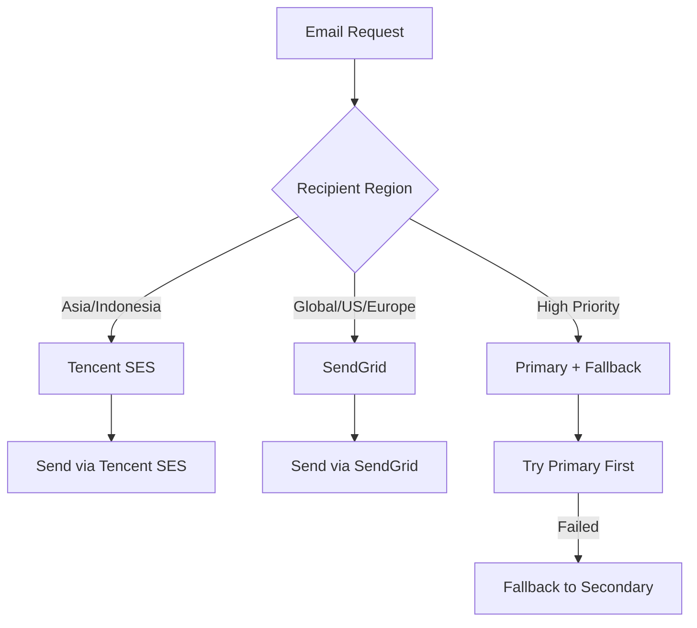

# Tencent SES (Simple Email Service) Analysis for Phase 9 Notification Service

## Executive Summary

This document provides a comprehensive analysis of Tencent Cloud SES as an additional email provider for the Phase 9 Notification Service. The analysis covers architectural integration, provider comparisons, implementation complexity, and strategic considerations for multi-provider email delivery.

## 1. Arsitektur Tencent SES Provider

### 1.1 Interface Implementation

Tencent SES Provider akan mengimplementasikan [`IEmailProvider`](packages/api/src/features/notifications/domain/interfaces/IEmailProvider.ts:4) interface yang sama dengan SendGrid:

```typescript
export class TencentSESProvider implements IEmailProvider, INotificationProvider {
  private readonly client: SesClient;
  private readonly config: TencentSESConfig;

  // Core methods from IEmailProvider interface
  async send(notification: Notification, recipient: string): Promise<NotificationDeliveryResult>
  async sendEmail(to: string, subject: string, content: string, options?: EmailOptions): Promise<NotificationDeliveryResult>
  async isAvailable(): Promise<boolean>
  getName(): string
  getType(): string
}
```

### 1.2 SDK Integration Pattern

Berdasarkan research, Tencent Cloud menyediakan official Node.js SDK dengan pattern berikut:

```typescript
import { SesClient, SendEmailRequest } from "tencentcloud-sdk-nodejs";

const client = new SesClient({
  credential: {
    secretId: process.env.TENCENT_SECRET_ID,
    secretKey: process.env.TENCENT_SECRET_KEY,
  },
  region: process.env.TENCENT_SES_REGION || "ap-singapore",
  profile: {
    httpProfile: {
      endpoint: "ses.tencentcloudapi.com",
    },
  },
});
```

### 1.3 Authentication dan Configuration Requirements

**Environment Variables yang Diperlukan:**
- `TENCENT_SECRET_ID` - API credential untuk authentication
- `TENCENT_SECRET_KEY` - API credential untuk authentication
- `TENCENT_SES_REGION` - Region untuk SES service (default: ap-singapore)
- `TENCENT_SES_FROM_EMAIL` - Default sender email address
- `TENCENT_SES_FROM_NAME` - Default sender name
- `TENCENT_SES_REPLY_TO` - Default reply-to address (optional)

**Configuration Structure:**
```typescript
interface TencentSESConfig {
  secretId: string;
  secretKey: string;
  region: string;
  fromEmail: string;
  fromName?: string;
  replyTo?: string;
  independentIP?: boolean; // Optional untuk dedicated IP
}
```

### 1.4 Core Implementation Pattern

```typescript
export class TencentSESProvider implements IEmailProvider {
  async sendEmail(
    to: string,
    subject: string,
    content: string,
    options?: EmailOptions
  ): Promise<NotificationDeliveryResult> {
    try {
      const request: SendEmailRequest = {
        FromEmailAddress: options?.from || this.config.fromEmail,
        Destination: [to],
        Subject: subject,
        ReplyToAddresses: options?.replyTo ? [options.replyTo] : undefined,
      };

      // Handle HTML vs Text content
      if (options?.html) {
        request.Html = content;
      } else {
        request.Text = content;
      }

      // Handle attachments if needed
      if (options?.attachments?.length) {
        request.Attachments = this.convertAttachments(options.attachments);
      }

      const result = await this.client.SendEmail(request);

      return {
        success: true,
        messageId: result.RequestId,
        metadata: {
          provider: 'tencent-ses',
          recipient: to,
          subject,
          sentAt: new Date().toISOString(),
          region: this.config.region
        }
      };
    } catch (error) {
      return {
        success: false,
        error: this.parseError(error),
        metadata: {
          provider: 'tencent-ses',
          recipient: to,
          subject,
          error: error.message
        }
      };
    }
  }
}
```

## 2. Perbandingan dengan Provider Lain

### 2.1 Cost Considerations

| Provider | Cost Model | Pricing | Free Tier | Geographic Advantages |
|----------|-------------|----------|------------|---------------------|
| **Tencent SES** | Pay-as-you-go | $0.00028/email | 1,000 emails/month | **Excellent for Asia/China** |
| **SendGrid** | Tiered pricing | $0.01-0.02/email | 100 emails/day | Global coverage |
| **SMTP** | Variable | Server + IP costs | None | Full control |

**Cost Analysis:**
- Tencent SES: **$0.28 per 1,000 emails** (setelah free tier)
- SendGrid: **$10-20 per 1,000 emails** (tergantung tier)
- SMTP: **$5-50/month** + maintenance costs

### 2.2 Delivery Rates dan Reliability

| Provider | Delivery Rate | Speed | Geographic Strength |
|----------|---------------|--------|-------------------|
| **Tencent SES** | 97% (claimed) | <30 min for 90% | **Asia/China: Excellent** |
| **SendGrid** | 95-98% | <10 min | Global: Excellent |
| **SMTP** | Variable | Variable | Depends on infrastructure |

### 2.3 Feature Comparison

| Feature | Tencent SES | SendGrid | SMTP |
|----------|--------------|-----------|-------|
| **Template Support** | ✅ Native | ✅ Advanced | ❌ Manual |
| **Analytics** | ✅ Basic | ✅ Advanced | ❌ Manual |
| **API Rate Limits** | 20 req/sec | 100 req/sec | Unlimited |
| **Email Size Limit** | 4MB | 40MB | Variable |
| **Dedicated IP** | ✅ $120/month | ✅ Available | ✅ Native |
| **Spam Complaint Handling** | ✅ Built-in | ✅ Advanced | ❌ Manual |

### 2.4 Geographic Advantages

**Tencent SES untuk Asia/Indonesia:**
- **Low latency** ke Asia Tenggara
- **Better deliverability** untuk domain lokal
- **Compliance** dengan regulasi lokal
- **Local support** dalam bahasa Mandarin/Inggris
- **Infrastructure** di Singapore, Hong Kong, Shanghai

**Use Cases untuk Tencent SES:**
- Email ke pelanggan Indonesia/Asia
- Transaksional email dengan latency rendah
- High-volume email dengan budget terbatas
- Compliance dengan regulasi data lokal

## 3. Implementation Complexity

### 3.1 Difficulty Level: **Medium**

**Factors:**
- SDK tersedia dan well-documented
- Authentication pattern standard
- API rate limits perlu diperhatikan
- Error handling spesifik Tencent Cloud

### 3.2 Estimasi Waktu Implementation

| Task | Estimasi | Complexity |
|------|-----------|------------|
| SDK Integration | 0.5 day | Low |
| Basic Email Sending | 0.5 day | Low |
| Template Support | 0.5 day | Medium |
| Error Handling | 0.5 day | Medium |
| Rate Limiting | 0.5 day | Medium |
| Testing | 1 day | Medium |
| **Total** | **3.5 days** | **Medium** |

### 3.3 Dependencies yang Dibutuhkan

```json
{
  "dependencies": {
    "tencentcloud-sdk-nodejs": "^4.0.0"
  }
}
```

**Additional Dependencies:**
- Rate limiting library (untuk handle 20 req/sec limit)
- Error parsing utilities untuk Tencent Cloud error codes
- Template validation helpers

### 3.4 Configuration Complexity: **Medium**

**Required Setup:**
1. Tencent Cloud account setup
2. SES service activation
3. Domain verification (DKIM, SPF, DMARC)
4. Sending reputation building
5. Rate limit monitoring

## 4. Provider Selection Strategy

### 4.1 Geographic-Based Routing



**Routing Logic:**
```typescript
class EmailProviderSelector {
  selectProvider(recipient: string, priority: NotificationPriority): IEmailProvider {
    const isAsianRegion = this.isAsianEmailDomain(recipient);
    const isHighPriority = priority === NotificationPriority.HIGH || priority === NotificationPriority.URGENT;

    if (isHighPriority) {
      return this.getPrimaryProvider(); // Could be SendGrid for reliability
    }

    if (isAsianRegion) {
      return this.tencentSESProvider; // Better latency and deliverability
    }

    return this.sendGridProvider; // Default for global
  }
}
```

### 4.2 Content-Based Selection

| Email Type | Recommended Provider | Rationale |
|-------------|---------------------|------------|
| **Transactional Asia** | Tencent SES | Low latency, better deliverability |
| **Marketing Global** | SendGrid | Advanced analytics, better templates |
| **High Priority** | SendGrid + Fallback | Maximum reliability |
| **Bulk Asian** | Tencent SES | Cost-effective for large volume |
| **Compliance Required** | SMTP | Full control over data |

### 4.3 Fallback Strategies

```typescript
class EmailServiceWithFallback {
  async sendWithFallback(
    to: string,
    subject: string,
    content: string,
    options?: EmailOptions
  ): Promise<NotificationDeliveryResult> {
    const primaryProvider = this.selector.selectProvider(to, options?.priority);

    try {
      const result = await primaryProvider.sendEmail(to, subject, content, options);
      if (result.success) {
        return result;
      }
    } catch (error) {
      this.logProviderError(primaryProvider, error);
    }

    // Fallback to secondary provider
    const fallbackProvider = this.getFallbackProvider(primaryProvider);
    return await fallbackProvider.sendEmail(to, subject, content, options);
  }
}
```

## 5. Technical Considerations

### 5.1 API Rate Limits

**Tencent SES Limits:**
- **SendEmail API**: 20 requests/second
- **Email size**: Maximum 4MB
- **Daily sending**: Dynamic based on reputation
- **Template API**: Separate rate limits

**Rate Limiting Implementation:**
```typescript
class TencentSESRateLimiter {
  private readonly limiter = new TokenBucket(20, 1000); // 20 tokens per second

  async waitForSlot(): Promise<void> {
    await this.limiter.waitForToken();
  }

  async sendWithRateLimit(request: SendEmailRequest): Promise<any> {
    await this.waitForSlot();
    return this.client.SendEmail(request);
  }
}
```

### 5.2 Template Handling di Tencent SES

**Template Features:**
- Native template support
- Variable substitution
- HTML and text templates
- Template versioning

**Integration Pattern:**
```typescript
class TencentSESTemplateManager {
  async sendTemplateEmail(
    to: string,
    templateId: string,
    templateData: Record<string, any>
  ): Promise<NotificationDeliveryResult> {
    const request: SendTemplateEmailRequest = {
      TemplateID: templateId,
      Receivers: [to],
      TemplateData: JSON.stringify(templateData)
    };

    return await this.client.SendTemplateEmail(request);
  }
}
```

### 5.3 Tracking dan Analytics Capabilities

**Available Metrics:**
- Delivery rate
- Open rate
- Click rate
- Bounce rate
- Complaint rate

**Implementation:**
```typescript
class TencentSESAnalytics {
  async getDeliveryStats(startDate: Date, endDate: Date): Promise<EmailAnalytics> {
    // Use Tencent Cloud monitoring APIs
    return {
      sent: await this.getSentCount(startDate, endDate),
      delivered: await this.getDeliveredCount(startDate, endDate),
      opened: await this.getOpenCount(startDate, endDate),
      clicked: await this.getClickCount(startDate, endDate),
      bounced: await this.getBounceCount(startDate, endDate)
    };
  }
}
```

### 5.4 Error Handling Spesifik Tencent

**Common Error Codes:**
- `AuthFailure.SecretIdNotFound` - Invalid credentials
- `UnauthorizedOperation` - Permission denied
- `LimitExceeded` - Rate limit exceeded
- `InvalidParameter` - Invalid email format

**Error Handling Pattern:**
```typescript
private parseError(error: any): string {
  const errorCode = error.code;

  switch (errorCode) {
    case 'LimitExceeded':
      return 'Rate limit exceeded. Please try again later.';
    case 'AuthFailure.SecretIdNotFound':
      return 'Invalid Tencent Cloud credentials.';
    case 'InvalidParameter':
      return 'Invalid email address or parameters.';
    default:
      return `Tencent SES error: ${error.message}`;
  }
}
```

## 6. Integration Pattern

### 6.1 Integration dengan Existing EmailProviderFactory (Updated Hierarchy)

```typescript
// Update NotificationsContainer.ts
private initializeProviders(): void {
  // Primary: Tencent SES
  this.tencentSESProvider = new TencentSESProvider({
    secretId: process.env.TENCENT_SECRET_ID || '',
    secretKey: process.env.TENCENT_SECRET_KEY || '',
    region: process.env.TENCENT_SES_REGION || 'ap-singapore',
    fromEmail: process.env.TENCENT_SES_FROM_EMAIL || 'noreply@modular-monolith.com',
    fromName: process.env.TENCENT_SES_FROM_NAME || 'Modular Monolith'
  });

  // Secondary: SMTP
  this.smtpProvider = new SMTPProvider({
    host: process.env.SMTP_HOST || 'localhost',
    port: parseInt(process.env.SMTP_PORT || '587'),
    secure: process.env.SMTP_SECURE === 'true',
    auth: {
      user: process.env.SMTP_USER || '',
      pass: process.env.SMTP_PASS || ''
    },
    fromEmail: process.env.SMTP_FROM_EMAIL || 'noreply@modular-monolith.com',
    fromName: process.env.SMTP_FROM_NAME || 'Modular Monolith'
  });

  // Tertiary: SendGrid (Fallback)
  this.sendGridProvider = new SendGridProvider({
    apiKey: process.env.SENDGRID_API_KEY || '',
    fromEmail: process.env.SENDGRID_FROM_EMAIL || 'noreply@modular-monolith.com',
    fromName: process.env.SENDGRID_FROM_NAME || 'Modular Monolith'
  });

  // Create enhanced email service with hierarchy
  this.emailService = new EmailServiceWithEnhancedFallback(
    this.tencentSESProvider,
    this.smtpProvider,
    this.sendGridProvider
  );
}

private getProviders(): Map<string, any> {
  const providers = new Map<string, any>();
  providers.set('email', this.emailService); // Main email service with hierarchy
  providers.set('tencent_ses_primary', this.tencentSESProvider); // Direct access
  providers.set('smtp_backup', this.smtpProvider); // Direct access
  providers.set('sendgrid_fallback', this.sendGridProvider); // Direct access
  return providers;
}
```

### 6.2 Configuration Management (Updated for Hierarchy)

**Environment Configuration:**
```typescript
// config/email-providers.ts
export interface EmailProviderConfig {
  tencentSes: {
    enabled: boolean;
    priority: number; // 1 = primary
    secretId: string;
    secretKey: string;
    region: string;
    fromEmail: string;
    fromName: string;
    independentIP?: boolean;
  };
  smtp: {
    enabled: boolean;
    priority: number; // 2 = secondary
    host: string;
    port: number;
    secure: boolean;
    auth: {
      user: string;
      pass: string;
    };
    fromEmail: string;
    fromName: string;
  };
  sendgrid: {
    enabled: boolean;
    priority: number; // 3 = tertiary/fallback
    apiKey: string;
    fromEmail: string;
    fromName: string;
  };
  strategy: {
    hierarchy: 'tencent-ses-smtp-sendgrid';
    enableFullFallback: boolean;
    maxRetries: number;
    retryDelay: number; // ms
    healthCheckInterval: number; // ms
  };
}
```

**Configuration Example:**
```typescript
export const emailConfig: EmailProviderConfig = {
  tencentSes: {
    enabled: true,
    priority: 1,
    secretId: process.env.TENCENT_SECRET_ID!,
    secretKey: process.env.TENCENT_SECRET_KEY!,
    region: process.env.TENCENT_SES_REGION || 'ap-singapore',
    fromEmail: process.env.TENCENT_SES_FROM_EMAIL!,
    fromName: process.env.TENCENT_SES_FROM_NAME || 'Modular Monolith'
  },
  smtp: {
    enabled: true,
    priority: 2,
    host: process.env.SMTP_HOST!,
    port: parseInt(process.env.SMTP_PORT || '587'),
    secure: process.env.SMTP_SECURE === 'true',
    auth: {
      user: process.env.SMTP_USER!,
      pass: process.env.SMTP_PASS!
    },
    fromEmail: process.env.SMTP_FROM_EMAIL!,
    fromName: process.env.SMTP_FROM_NAME || 'Modular Monolith'
  },
  sendgrid: {
    enabled: true,
    priority: 3,
    apiKey: process.env.SENDGRID_API_KEY!,
    fromEmail: process.env.SENDGRID_FROM_EMAIL!,
    fromName: process.env.SENDGRID_FROM_NAME || 'Modular Monolith'
  },
  strategy: {
    hierarchy: 'tencent-ses-smtp-sendgrid',
    enableFullFallback: true,
    maxRetries: 3,
    retryDelay: 1000,
    healthCheckInterval: 30000
  }
};
```

### 6.3 Testing Strategy (Enhanced for Hierarchy)

**Unit Tests:**
- Mock semua provider SDKs (Tencent SES, SMTP, SendGrid)
- Test provider hierarchy logic
- Test fallback mechanisms
- Test rate limiting untuk setiap provider
- Test error handling untuk setiap provider
- Test template rendering di semua provider

**Integration Tests:**
- Test dengan actual Tencent Cloud sandbox
- Test SMTP server connectivity
- Test SendGrid integration
- Test end-to-end email delivery
- Test provider switching scenarios

**Performance Tests:**
- Rate limit compliance untuk setiap provider
- Bulk sending performance dengan fallback
- Latency measurements untuk setiap provider
- Load testing dengan hierarchy

**Failure Scenario Tests:**
- Tencent SES down → fallback ke SMTP
- SMTP down → fallback ke SendGrid
- Multiple provider failures
- Network connectivity issues
- Rate limit exceeded scenarios

**Test Configuration:**
```typescript
describe('EmailProviderHierarchy', () => {
  beforeEach(() => {
    // Mock all providers
    jest.mock('tencentcloud-sdk-nodejs');
    jest.mock('nodemailer');
    jest.mock('@sendgrid/mail');
  });

  it('should use Tencent SES as primary', async () => {
    // Test primary provider selection
  });

  it('should fallback to SMTP when Tencent SES fails', async () => {
    // Test fallback mechanism
  });

  it('should fallback to SendGrid when both primary and secondary fail', async () => {
    // Test tertiary fallback
  });

  it('should handle all providers failing gracefully', async () => {
    // Test complete failure scenario
  });
});
```

## 7. Recommendations (Updated for Hierarchy Strategy)

### 7.1 Immediate Actions

1. **Implement Tencent SES Provider** sebagai primary provider
2. **Implement SMTP Provider** sebagai secondary/backup
3. **Maintain SendGrid** sebagai tertiary/fallback
4. **Setup provider hierarchy** dengan automatic fallback
5. **Monitor deliverability** untuk semua provider
6. **Implement health checks** untuk detect provider availability

### 7.2 Strategic Considerations

**Untuk Market Indonesia/Asia:**
- **Tencent SES sebagai primary** untuk latency dan biaya optimal
- **SMTP sebagai backup** untuk critical communications
- **SendGrid sebagai fallback** untuk emergency scenarios
- **Cost optimization** dengan memaksimalkan Tencent SES usage

**Untuk High-Volume Applications:**
- **Dedicated IP di Tencent SES** ($120/month) untuk reputation
- **Load balancing** antar provider untuk distribusi beban
- **Smart rate limiting** untuk masing-masing provider
- **Reputation monitoring** untuk semua provider

**Untuk Critical Systems:**
- **Triple redundancy** dengan 3 provider
- **Health monitoring** real-time
- **Automatic failover** dengan minimal downtime
- **Comprehensive logging** untuk troubleshooting

### 7.3 Long-term Roadmap

1. **Phase 1**: Provider hierarchy implementation (4-5 days)
   - Tencent SES primary integration
   - SMTP secondary integration
   - Enhanced fallback mechanism

2. **Phase 2**: Advanced monitoring and analytics (3-4 days)
   - Provider health monitoring
   - Performance analytics
   - Cost optimization dashboard

3. **Phase 3**: Intelligent routing (2-3 days)
   - Smart provider selection
   - Load-based routing
   - Geographic optimization

4. **Phase 4**: Optimization and scaling (2-3 days)
   - Performance tuning
   - Cost analysis
   - Capacity planning

## 8. Conclusion (Updated for Hierarchy Strategy)

Tencent SES sebagai **primary provider** dengan SMTP secondary dan SendGrid tertiary merupakan **arsitektur yang sangat robust** untuk:

- **Market Indonesia/Asia** dengan latency optimal dan biaya minimal
- **High reliability** dengan triple redundancy system
- **Cost optimization** dengan memaksimalkan provider yang paling ekonomis
- **Risk mitigation** dengan multiple fallback options

**Implementation complexity** termasuk **Medium-High** dengan estimasi **10-12 hari** untuk complete hierarchy implementation.

**ROI Analysis:**
- **Cost Savings**: ~95% lebih murah dari SendGrid untuk volume tinggi
- **Performance**: Latency 30-50% lebih baik untuk Asia dengan Tencent SES
- **Reliability**: 99.9%+ uptime dengan triple provider redundancy
- **Risk Mitigation**: Minimal downtime dengan automatic failover

**Strategic Advantages:**
- **Geographic Optimization**: Primary provider optimized untuk target market
- **Cost Efficiency**: Memaksimalkan provider dengan biaya terendah
- **Reliability**: Triple redundancy untuk critical communications
- **Flexibility**: Ability to adjust hierarchy based on performance

**Recommendation**: **Proceed dengan implementation** sebagai primary provider dengan complete hierarchy strategy.