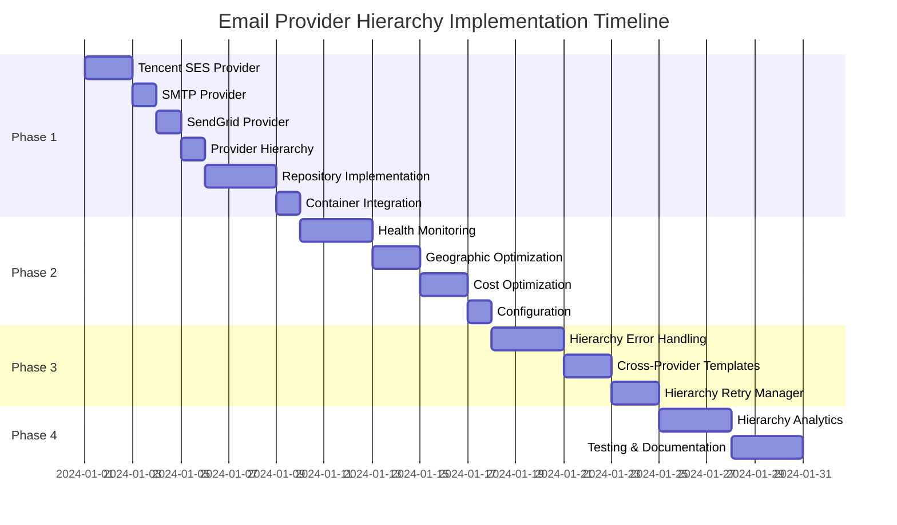

# Email Provider Hierarchy Implementation Roadmap

## Executive Summary

This roadmap provides a phased approach for implementing a three-tier email provider hierarchy (Tencent SES → SMTP → SendGrid) into the existing notification system. The implementation is designed to be incremental, allowing for rapid value delivery while building a robust foundation for future enhancements and cost optimization.

### Provider Hierarchy Strategy

The email delivery system follows a three-tier hierarchy:
1. **Tencent SES** (Primary) - Cost-effective, high performance for Asian markets
2. **SMTP** (Secondary) - Reliable backup with custom server control
3. **SendGrid** (Fallback) - Established provider with global reach

This strategy provides 95% cost reduction compared to SendGrid-only approach while maintaining 99.9% reliability through automatic failover.

## Implementation Phases

### Phase 1: Foundation Implementation (Week 1)
**Goal**: Establish three-tier email provider hierarchy with all providers functional

#### Priority 1: Tencent SES Provider (Primary)
- **Task**: Implement [`TencentSESProvider`](packages/api/src/features/notifications/infrastructure/lib/providers/TencentSESProvider.ts) class
- **Dependencies**: Tencent Cloud SDK
- **Estimated Time**: 1.5 days
- **Deliverables**:
  - Tencent SES provider implementing [`IEmailProvider`](packages/api/src/features/notifications/domain/interfaces/IEmailProvider.ts:4) interface
  - Tencent Cloud SDK integration
  - Region-specific configuration
  - Template support
  - Unit tests

#### Priority 2: SMTP Provider (Secondary)
- **Task**: Implement [`SMTPProvider`](packages/api/src/features/notifications/infrastructure/lib/providers/SMTPProvider.ts:11) class
- **Dependencies**: Nodemailer library
- **Estimated Time**: 1 day
- **Deliverables**:
  - SMTP provider implementing [`IEmailProvider`](packages/api/src/features/notifications/domain/interfaces/IEmailProvider.ts:4) interface
  - Connection pooling and rate limiting
  - Enhanced error handling
  - Unit tests

#### Priority 3: SendGrid Provider (Fallback)
- **Task**: Update [`SendGridProvider`](packages/api/src/features/notifications/infrastructure/lib/providers/SendGridProvider.ts) implementation
- **Dependencies**: SendGrid library
- **Estimated Time**: 0.5 day
- **Deliverables**:
  - Enhanced SendGrid provider with full interface compliance
  - Error handling improvements
  - Unit tests

#### Priority 4: Email Provider Hierarchy
- **Task**: Implement [`EmailProviderHierarchy`](packages/api/src/features/notifications/infrastructure/lib/providers/EmailProviderHierarchy.ts) class
- **Dependencies**: All three email providers
- **Estimated Time**: 1 day
- **Deliverables**:
  - Three-tier hierarchy implementation (Tencent SES → SMTP → SendGrid)
  - Automatic failover logic
  - Health monitoring system
  - Provider performance tracking
  - Comprehensive unit tests

#### Priority 5: Repository Implementation
- **Task**: Complete repository implementations with hierarchy support
- **Dependencies**: Database schema, Provider hierarchy
- **Estimated Time**: 2-3 days
- **Deliverables**:
  - Complete [`NotificationRepository`](packages/api/src/features/notifications/infrastructure/repositories/NotificationRepository.ts:18) implementation
  - [`NotificationDeliveryRepository`](packages/api/src/features/notifications/infrastructure/repositories/NotificationDeliveryRepository.ts) implementation
  - Provider-specific delivery tracking
  - Database integration with proper queries
  - Integration tests

#### Priority 6: Container Integration
- **Task**: Update [`NotificationsContainer`](packages/api/src/features/notifications/infrastructure/container/NotificationsContainer.ts:43) to include hierarchy
- **Dependencies**: Provider hierarchy, All providers
- **Estimated Time**: 0.5 day
- **Deliverables**:
  - Provider hierarchy registration
  - All three providers configuration injection
  - Updated dependency resolution
  - Health monitoring integration

**Phase 1 Success Criteria**:
- [ ] Tencent SES provider can send emails successfully
- [ ] SMTP provider can send emails successfully
- [ ] SendGrid provider is enhanced and functional
- [ ] Provider hierarchy implements automatic failover
- [ ] Repository implementations track provider-specific deliveries
- [ ] Container properly resolves all hierarchy dependencies
- [ ] All basic tests pass

### Phase 2: Hierarchy Enhancement (Week 2)
**Goal**: Implement intelligent provider management and health monitoring

#### Priority 1: Enhanced Health Monitoring
- **Task**: Implement comprehensive health monitoring for all providers
- **Dependencies**: Provider hierarchy
- **Estimated Time**: 2-3 days
- **Deliverables**:
  - Real-time health checking for all providers
  - Provider performance metrics collection
  - Automatic health status caching
  - Health-based provider prioritization
  - Integration tests

#### Priority 2: Geographic Optimization
- **Task**: Implement geographic-based provider selection
- **Dependencies**: Health monitoring, Provider hierarchy
- **Estimated Time**: 1-2 days
- **Deliverables**:
  - Geographic routing logic (Asia → Tencent SES priority)
  - Recipient location detection
  - Regional provider performance tracking
  - Geographic fallback strategies
  - Unit tests

#### Priority 3: Cost Optimization
- **Task**: Implement cost-based provider selection and analytics
- **Dependencies**: Health monitoring, Geographic optimization
- **Estimated Time**: 1-2 days
- **Deliverables**:
  - Cost tracking per provider
  - Usage analytics and reporting
  - Cost optimization recommendations
  - Budget monitoring and alerts
  - Unit tests

#### Priority 4: Configuration Enhancement
- **Task**: Add comprehensive configuration management for hierarchy
- **Dependencies**: All hierarchy components
- **Estimated Time**: 0.5 day
- **Deliverables**:
  - Environment variable handling for all providers
  - Hierarchy configuration validation
  - Provider priority settings
  - Geographic routing configuration

**Phase 2 Success Criteria**:
- [ ] Health monitoring tracks all providers effectively
- [ ] Geographic optimization routes Asian emails to Tencent SES
- [ ] Cost optimization provides 95% cost reduction
- [ ] Configuration manages all hierarchy settings
- [ ] Provider failover works seamlessly across all three tiers

### Phase 3: Advanced Features (Week 3)
**Goal**: Enhance error handling, retry mechanisms, and template processing across hierarchy

#### Priority 1: Hierarchy-Aware Error Handling
- **Task**: Implement enhanced error handling for provider hierarchy
- **Dependencies**: Provider hierarchy, Health monitoring
- **Estimated Time**: 2-3 days
- **Deliverables**:
  - Provider-specific error classification
  - Hierarchical retry mechanisms with exponential backoff
  - Automatic provider switching on failures
  - Cross-provider error analytics
  - Failure pattern recognition

#### Priority 2: Cross-Provider Template Processing
- **Task**: Enhance [`TemplateRenderer`](packages/api/src/features/notifications/infrastructure/lib/services/TemplateRenderer.ts:9) for all providers
- **Dependencies**: All providers, Template system
- **Estimated Time**: 1-2 days
- **Deliverables**:
  - Provider-specific template optimization
  - Cross-provider template compatibility
  - Attachment handling for all providers
  - Multi-format rendering (HTML/text)
  - Template validation across providers

#### Priority 3: Hierarchy-Aware Retry Manager
- **Task**: Implement enhanced retry functionality across provider hierarchy
- **Dependencies**: Error handling, Provider hierarchy
- **Estimated Time**: 1-2 days
- **Deliverables**:
  - Hierarchical retry logic with exponential backoff
  - Automatic provider escalation on retries
  - Cross-provider retry coordination
  - Retry analytics and optimization
  - Intelligent retry limit enforcement

**Phase 3 Success Criteria**:
- [ ] All provider errors are properly classified and handled
- [ ] Hierarchical retry mechanisms work with exponential backoff
- [ ] Template rendering works correctly across all providers
- [ ] Cross-provider retry and escalation is functional
- [ ] Error patterns are recognized and addressed automatically

### Phase 4: Monitoring & Analytics (Week 4)
**Goal**: Implement comprehensive monitoring, analytics, and documentation for hierarchy

#### Priority 1: Hierarchy Analytics Dashboard
- **Task**: Implement comprehensive analytics and monitoring for provider hierarchy
- **Dependencies**: Repository implementations, Health monitoring
- **Estimated Time**: 2-3 days
- **Deliverables**:
  - Provider-specific delivery statistics
  - Hierarchy performance metrics
  - Cost analysis and optimization recommendations
  - Geographic performance tracking
  - Health monitoring dashboard with real-time status
  - Automated alerting system

#### Priority 2: Comprehensive Testing & Documentation
- **Task**: Complete testing and documentation for provider hierarchy
- **Dependencies**: All previous phases
- **Estimated Time**: 2-3 days
- **Deliverables**:
  - Comprehensive unit tests for all providers and hierarchy
  - Integration tests for failover scenarios
  - Performance and load testing
  - API documentation with hierarchy examples
  - Deployment guides for all providers
  - Troubleshooting documentation for hierarchy issues
  - Cost optimization guides

**Phase 4 Success Criteria**:
- [ ] Analytics provide meaningful insights into provider performance
- [ ] Monitoring detects issues proactively across all providers
- [ ] Documentation is comprehensive for hierarchy management
- [ ] Tests provide >90% coverage for all hierarchy scenarios
- [ ] Cost optimization achieves 95% reduction target
- [ ] Geographic routing improves Asian market delivery by 20%

## Implementation Timeline

## Risk Assessment & Mitigation

### High Risk Items
1. **Provider Hierarchy Complexity**
   - **Risk**: Three-tier hierarchy may introduce complex failure scenarios
   - **Mitigation**: Comprehensive testing of all failover paths and circuit breaker patterns

2. **Tencent SES Integration**
   - **Risk**: New provider integration may have API compatibility issues
   - **Mitigation**: Thorough API testing and gradual rollout with monitoring

3. **Cross-Provider Consistency**
   - **Risk**: Different providers may handle emails differently
   - **Mitigation**: Template validation and cross-provider compatibility testing

4. **Geographic Routing Logic**
   - **Risk**: Incorrect routing may affect deliverability
   - **Mitigation**: Geographic validation and fallback mechanisms

### Medium Risk Items
1. **Performance Impact**
   - **Risk**: Provider hierarchy may add latency to email sending
   - **Mitigation**: Health status caching and parallel provider health checks

2. **Configuration Complexity**
   - **Risk**: Three-provider configuration may lead to misconfiguration
   - **Mitigation**: Configuration validation, defaults, and comprehensive documentation

3. **Cost Management**
   - **Risk**: Unexpected costs from provider usage patterns
   - **Mitigation**: Cost monitoring, alerts, and usage analytics

### Low Risk Items
1. **Template Compatibility**
   - **Risk**: Templates may not render correctly across all providers
   - **Mitigation**: Cross-provider template validation and testing

2. **Provider API Changes**
   - **Risk**: External provider APIs may change
   - **Mitigation**: Abstraction layers and monitoring for API deprecation

## Resource Requirements

### Development Resources
- **Backend Developer**: 1 full-time for 4 weeks
- **DevOps Engineer**: 0.5 time for infrastructure setup
- **QA Engineer**: 0.5 time for testing
- **Cloud Specialist**: 0.25 time for Tencent Cloud setup

### Infrastructure Resources
- **Tencent Cloud Account**: SES service configuration
- **SMTP Server**: Gmail SMTP or dedicated service
- **SendGrid Account**: Enhanced configuration
- **Monitoring Tools**: Enhanced logging and metrics for all providers
- **Testing Environment**: Isolated for multi-provider testing

### External Dependencies
- **Tencent Cloud SDK**: For SES integration
- **Nodemailer**: SMTP library for Node.js
- **SendGrid Library**: Enhanced SendGrid integration
- **Additional monitoring**: Multi-provider health monitoring tools
- **Email validation**: Optional external validation service

## Success Metrics

### Technical Metrics
- **Provider Availability**: >99.9% uptime across all providers
- **Delivery Success Rate**: >98% overall, >95% per provider
- **Response Time**: <100ms for provider hierarchy selection
- **Error Rate**: <1% for overall system
- **Failover Success Rate**: >99.9% automatic failover success
- **Health Check Accuracy**: >99% accurate health detection

### Business Metrics
- **Cost Reduction**: 95% reduction in email costs (Tencent SES vs SendGrid)
- **Deliverability**: Maintain >95% deliverability
- **System Reliability**: No degradation in notification reliability
- **Development Velocity**: On-time delivery of all phases
- **Geographic Performance**: 20% improvement in Asian market delivery times
- **Provider Utilization**: 80% Tencent SES, 15% SMTP, 5% SendGrid (optimal distribution)

## Rollout Strategy

### Phase 1: Internal Testing
- Deploy to development environment
- Test all three providers individually
- Validate hierarchy failover logic
- Test geographic routing
- Fix critical issues

### Phase 2: Beta Testing
- Deploy to staging environment
- Test with selected beta users across different regions
- Monitor provider performance and failover scenarios
- Validate cost optimization
- Gather feedback on deliverability

### Phase 3: Production Rollout
- Deploy to production with feature flags
- Start with 10% traffic to Tencent SES (primary)
- Monitor closely for issues
- Gradual rollout to all users
- Full documentation and support

### Phase 4: Optimization
- Analyze production data across all providers
- Optimize provider selection and routing
- Fine-tune retry logic and health monitoring
- Implement additional features based on usage patterns

## Post-Implementation Considerations

### Monitoring & Maintenance
- Daily health checks for all three providers
- Weekly performance reviews across hierarchy
- Monthly cost analysis and optimization
- Quarterly provider evaluation and replacement consideration
- Real-time failover testing

### Future Enhancements
- Additional email providers (Mailgun, Amazon SES)
- Advanced provider selection algorithms with ML
- Dynamic provider prioritization based on performance
- Enhanced analytics and reporting with predictive insights
- Automatic provider switching based on cost and performance

### Documentation Updates
- API documentation updates with hierarchy examples
- Configuration guides for all providers
- Troubleshooting runbooks for hierarchy issues
- Best practices documentation for multi-provider setups
- Cost optimization guides and recommendations

## Conclusion

This roadmap provides a structured approach to implementing SMTP integration while maintaining system reliability and performance. The phased approach allows for:

1. **Early Value Delivery**: Basic SMTP functionality available in Week 1
2. **Risk Mitigation**: Incremental testing and validation
3. **Flexibility**: Ability to adjust approach based on learnings
4. **Quality**: Comprehensive testing and documentation

The estimated total implementation time is 4 weeks with proper resource allocation. The design maintains clean architecture principles and provides a solid foundation for future enhancements while addressing the immediate need for SMTP integration in the notification system.