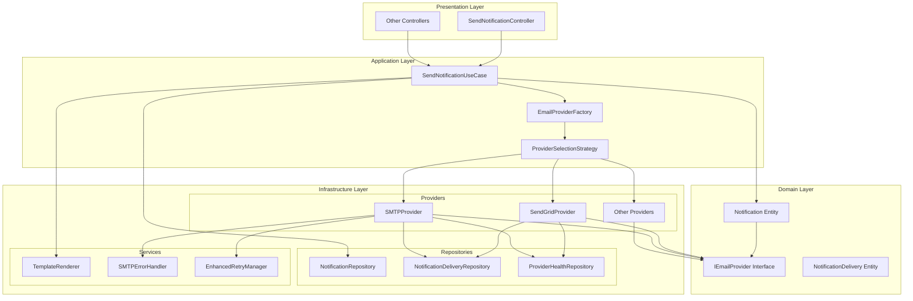
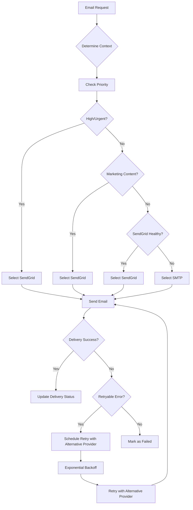
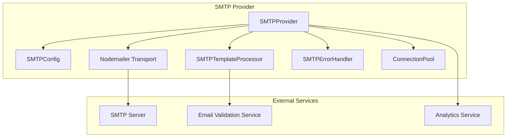
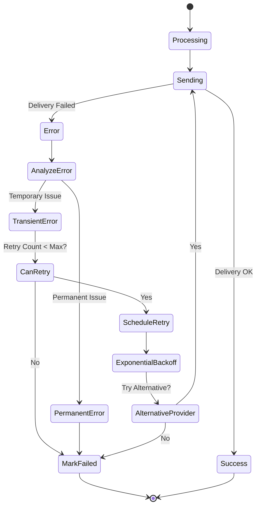
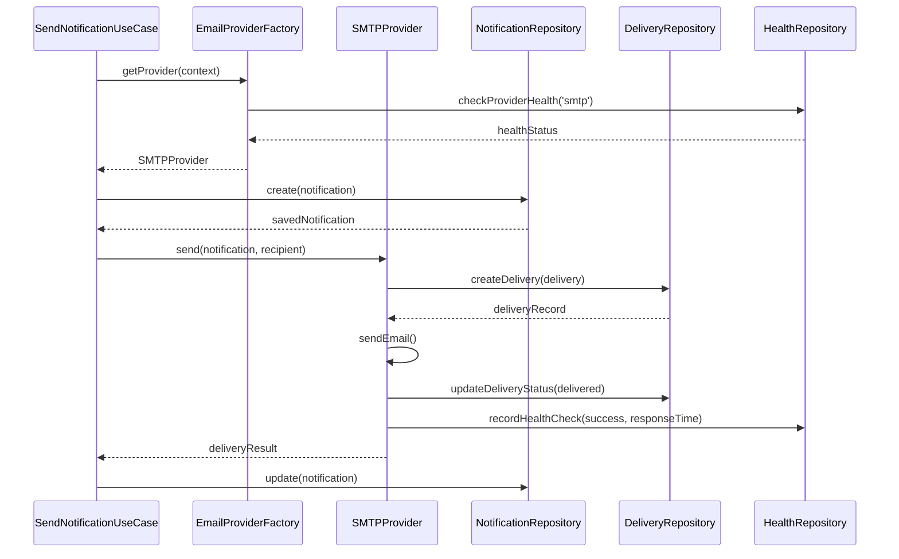

# SMTP Integration Architecture Diagrams

## Overview Diagram



## Provider Selection Flow



## SMTP Provider Architecture



## Error Handling and Retry Flow



## Repository Implementation Flow



## Configuration Hierarchy

```mermaid
graph TD
    A[Environment Variables] --> B[NotificationConfig]
    B --> C[EmailConfig]
    C --> D[ProvidersConfig]
    C --> E[SelectionConfig]
    C --> F[TemplateConfig]

    D --> G[SendGridConfig]
    D --> H[SMTPConfig]

    E --> I[Strategy]
    E --> J[PrimaryProvider]
    E --> K[FallbackProvider]
    E --> L[HealthCheckInterval]

    H --> M[Host/Port]
    H --> N[Authentication]
    H --> O[ConnectionPool]
    H --> P[RateLimiting]